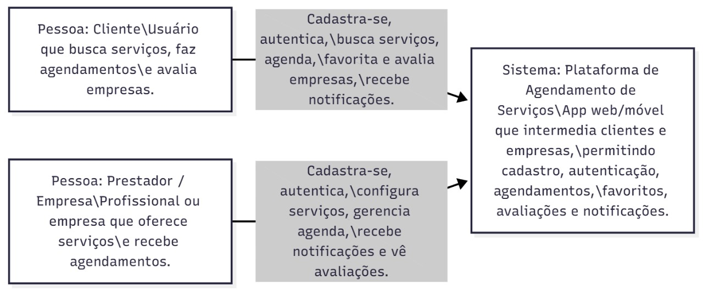
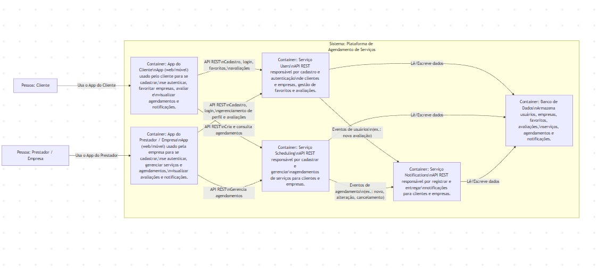

# TECH ACADEMY 8 - Agenda Fácil

**Membros do Grupo:**
Samuel Ernandes dos Santos,
Paulo Eduardo Fernandes Rodrigues,
Milena Santos

---

## 1. Visão do Produto

Ser a plataforma que **aproxima pessoas**. Queremos transformar a maneira como clientes encontram e contratam profissionais autônomos no Brasil, oferecendo uma experiência simples, rápida e segura. Nossa visão é criar um ambiente onde a **confiança seja natural**, o agendamento seja fácil e cada serviço gere mais tranquilidade, oportunidades e relações de valor para todos.

---

## 2. Métricas de Sucesso

**Métrica 1 – Taxa de agendamentos concluídos com sucesso (>75% em 30 dias)**

Indica o nível de aderência entre a demanda dos clientes e a disponibilidade dos prestadores, além da eficiência no fluxo de agendamento.

**Métrica 2 – Tempo médio para um prestador aceitar um serviço (<1h após a solicitação)**

Mede a agilidade da plataforma e a atratividade das oportunidades para os profissionais cadastrados.

**Métrica 3 – Percentual de avaliações positivas após o serviço (>90%)**

Reflete a qualidade das prestações de serviço, a confiança entre usuários e prestadores e a solidez da experiência na plataforma.

---

## 3. Antiobjetivos (fora do escopo inicial/MVP)

- Automação de faturamento e emissão de NF-e dentro do aplicativo
- Integração com rastreamento e telemetria em tempo real para empresas privadas
- O sistema de busca e agendamento funciona sem falhas

---

## 4. Stakeholders

### 4.1 – Cliente (Usuário Final Mobile)

Utiliza o aplicativo para buscar profissionais, comparar opções, agendar serviços e acompanhar o atendimento.

### 4.2 – Prestador de Serviço (Eletricista, Encanador, Mecânico, etc.)

Profissional autônomo que recebe solicitações, aceita agendamentos, executa os serviços e mantém seu perfil atualizado.

### 4.3 – Administrador da Plataforma

Gerência cadastros, denúncias, avaliações, categorias de serviços, políticas e parâmetros operacionais do aplicativo.

### 4.4 – Equipe Técnica (Dev / QA / UX)

Responsável pelo desenvolvimento, testes, design, melhorias contínuas, publicação e manutenção do app e da API.

### 4.5 – Suporte / Atendimento ao Usuário

Resolve dúvidas, auxilia em problemas de acesso, corrige incidentes e intermedia questões entre cliente e prestador.

### 4.6 – Patrocinador / Dono do Produto

Financia o projeto, define metas estratégicas, prioridades do roadmap e acompanha indicadores de valor do negócio.

### 4.7 – Parceiros Comerciais (Indiretos)

Empresas de ferramentas, lojas de materiais ou parceiros que futuramente podem oferecer descontos e benefícios dentro do app.

### 4.8 – Órgãos Reguladores / Legislação (Indireto)

Envolve normas relacionadas a segurança do consumidor, proteção de dados (LGPD) e regulamentações de prestação de serviços.

---

## 5. Personas

### 5.1 – Persona: Cliente Usuário

- **Descrição / Objetivo**: Pessoa que busca um jeito rápido e confiável de agendar serviços com profissionais autônomos.
- **Responsabilidades**: Buscar prestadores, visualizar agenda disponível, agendar serviços, avaliar após atendimento.
- **Interface**: App Mobile (lista de serviços, perfil do prestador, calendário).
- **Dores**: Dificuldade em encontrar profissionais confiáveis; demora para obter retorno; necessidade de organizar horários sem complicação.

### 5.2 – Persona: Prestador de Serviços (Autônomo)

- **Descrição / Objetivo**: Profissional que deseja aumentar sua base de clientes e organizar sua agenda de forma simples.
- **Responsabilidades**: Disponibilizar horários, responder solicitações, confirmar serviços, manter perfil atualizado.
- **Interface**: App Mobile (agenda, perfil, histórico de atendimentos).
- **Dores**: Falta de visibilidade; dificuldades em administrar agenda; cancelamentos inesperados; comunicação dispersa.

### 5.3 – Persona: Equipe Técnica (Dev / QA)

- **Descrição / Objetivo**: Desenvolver, testar e manter o backend, app e integração.
- **Responsabilidades**: Criar funcionalidades, corrigir bugs, manter API, garantir segurança e estabilidade.
- **Interface**: Repositório de código, documentação técnica, logs, Swagger.
- **Dores**: Requisitos pouco definidos; necessidade de padronização; retrabalho por falta de clareza em regras de negócio.

### 5.4 – Persona: Suporte / Atendimento

- **Descrição / Objetivo**: Resolver dúvidas e problemas simples dos usuários.
- **Responsabilidades**: Ajudar com login, agendamentos, inconsistências na agenda, orientações gerais.
- **Interface**: Painel de suporte, scripts de atendimento, logs.
- **Dores**: Falta de ferramentas de diagnóstico; repetição de problemas comuns; ausência de histórico consolidado.

---

## 6. Diagramas C4:

### 6.1 - Diagrama de contexto:

| Entidade                                           | Descrição                                                                                                                                |
| :------------------------------------------------- | :--------------------------------------------------------------------------------------------------------------------------------------- |
| **Pessoa: Cliente/Usuário**                        | busca serviços, faz agendamentos e avalia empresas.                                                                                      |
| **Pessoa: Prestador / Empresa**                    | Profissional ou empresa que oferece serviços e recebe agendamentos.                                                                      |
| **Sistema: Plataforma de Agendamento de Serviços** | App web/móvel que intermedia clientes e empresas, permitindo cadastro, autenticação, agendamentos, favoritos, avaliações e notificações. |



### 6.2 - Diagrama de container:

O Container Service (Search) e o Container Service (Scheduling) interagem com o Container Service (Notifications) e com o Container Service (Backend/DB) que armazena avaliações, favoritos, agendamentos e notificações.



---

## Domínios da aplicação:

### Domínio Principal:

O domínio principal do Agenda Fácil é a conexão digital entre clientes e prestadores de serviços autônomos, oferecendo uma forma prática, organizada e confiável de agendar atendimentos. Esse domínio representa o núcleo funcional da aplicação e concentra todas as regras de negócio essenciais para que o usuário consiga encontrar o profissional ideal, marcar um horário disponível e acompanhar seu atendimento com simplicidade. Sua função central é eliminar barreiras entre quem precisa de um serviço e quem está disponível para oferecê-lo, criando um ecossistema eficiente, transparente e acessível.

### Subdomínios:

| Tipo      | Subdomínio                              | Função                                                                                                                                                                  |
| :-------- | :-------------------------------------- | :---------------------------------------------------------------------------------------------------------------------------------------------------------------------- |
| Principal | Agendamento de Serviços                 | Controla todo o fluxo de marcação de horários entre clientes e prestadores; verificar disponibilidade, reservar horários, gerenciar conflitos e confirmar atendimentos. |
| Principal | Gestão de Profissionais e Serviços      | Permite que os prestadores configurem seu perfil, seus serviços, duração, preços e horários, controla visibilidade e categorias de atuação.                             |
| Principal | Busca e Conexão Cliente – Prestador     | Realiza a busca por profissionais com base em localização, categoria, avaliações e disponibilidade, conectando clientes ao prestador ideal.                             |
| Suporte   | Notificações e Alertas                  | Enviar notificações push, e-mail ou mensagens para lembrar compromissos, avisar alterações, confirmar reservas ou comunicar cancelamentos.                              |
| Suporte   | Avaliações e Feedback                   | Permite que clientes avaliem profissionais e deixem comentários após o atendimento, ajudando a criar reputação e confiança no app.                                      |
| Suporte   | Histórico e Registro de Atendimentos    | Armazena os atendimentos concluídos, cancelados ou reagendados, permitindo análises futuras e transparência para o cliente e profissional.                              |
| Genérico  | Autenticação e Perfis de Usuário        | Gerencia login, cadastro, autenticação via token, perfis (cliente e prestador), permissões e gerenciamento de informações pessoais.                                     |
| Genérico  | Pagamentos e Confirmações (futuro)      | No futuro, permitirá integrar meios de pagamento para confirmar serviços, sinalizar agendamentos e processar valores com segurança.                                     |
| Genérico  | Configurações e Preferências do Usuário | Gerência de idiomas, notificações, dados pessoais, políticas de uso e personalizações gerais da conta.                                                                  |

---

## Bounded Contexts:

### Visão Empresa (Prestadores)

Abrange todas as funcionalidades relacionadas aos prestadores de serviço que utilizam o app para divulgar seu trabalho.

**Responsabilidades:**

- Cadastro de prestadores e seus serviços.
- Gestão de agenda e horários disponíveis.
- Configuração de duração, preço e categorias de serviços.
- Controle de visibilidade do perfil.
- Recebimento de avaliações e feedbacks.

### Visão Usuário (Clientes)

Focado na experiência do cliente final que utiliza o app para agendar serviços.

**Responsabilidades:**

- Buscar profissionais por categoria, localização ou especialidade.
- Verificar disponibilidade e horários livres.
- Realizar reservas e confirmar agendamentos.
- Receber notificações, lembretes e atualizações.
- Avaliar profissionais após atendimento.

### Gerenciamento de Dados de Usuário

Contexto dedicado ao perfil principal:

**Responsabilidades:**

- Cadastro e autenticação (clientes e prestadores).
- Atualização de dados pessoais.
- Gestão de permissões e níveis de acesso (Implementação pro futuro).
- Segurança de credenciais.

### Comunicação e Notificações

**Descrição**: Gerencia toda a comunicação automatizada entre plataforma, prestadores e clientes. Inclui notificações, lembretes e confirmações de ações do sistema.

**Principais Funções:**

- Enviar notificações de confirmação ou alteração de agendamentos.
- Lembrar o cliente sobre o atendimento (ex: 1 hora antes).
- Notificar prestadores sobre novos agendamentos.
- Notificar clientes sobre cancelamentos e atrasos.
- Enviar avisos por canais integrados (Push, E-mail, SMS, WhatsApp).

---

## Entities, Values e Aggregates:

### Entities (Entidades)

- Usuário
- Prestador
- Serviço
- Agendamento

### Value Objects (Objetos de Valor)

- Endereço
- Slot de horário (10h às 11h)
- Preço (R$ 80,00)
- Categoria de Serviço

### Aggregates (Agregados)

| Agregado        | Entidade Raiz | Entidades Internas              | Value Objects                    |
| :-------------- | :------------ | :------------------------------ | :------------------------------- |
| **Agendamento** | Agendamento   | Serviço, Prestador, Cliente     | Data/Horário, Status, Notas      |
| **Prestador**   | Prestador     | Lista de serviços               | Endereço, Disponibilidade, Preço |
| **Usuário**     | Usuário       | Nenhuma (somente Value Objects) | E-mail, SenhaHash, Telefone      |

---

## Decisões Arquiteturais (ADR):

### ADR 8.1 – Escolha de Arquitetura (Monolito + Microsserviços)

O app Agenda Fácil precisa suportar:

- agendamentos em tempo real,
- comunicação por notificações,
- cadastro e gerenciamento de usuários,
- além de outras funcionalidades internas simples.

**Monolito completo**

- Simples de criar e manter.
- Difícil de escalar partes específicas.
- Deploy único e acoplado.

**Arquitetura 100% microsserviços**

- Maior escalabilidade e resiliência.
- Maior complexidade operacional (infra, DevOps, mensageria).
- Exige maturidade técnica e orquestração (K8s, observabilidade etc.).

**Arquitetura híbrida (Monolito + Microsserviços) – opção escolhida**

- O núcleo permanece monolítico para reduzir a complexidade.
- Serviços críticos isolados como microsserviços independentes.
- Balanceia simplicidade e escalabilidade.

**Decisão**
Adotar arquitetura híbrida, onde:

- **Monolito contém**:
  - gestão de profissionais,
  - serviços,
  - preferências,
- **Microsserviços independentes**:
  - Agendamento
  - Notificações
  - Cadastro de Cliente (Usuário)

Estes microsserviços têm requisitos diferentes, maior variabilidade de carga e justificam isolamento.

**Consequências**

- **Positivas**:
  - Escalabilidade sob demanda dos serviços críticos (agendamento e notificações).
  - Menos acoplamento entre componentes sensíveis.
  - Evolução independente dos microsserviços.
  - Simplificação do core monolítico.
- **Negativas**:
  - Introdução de complexidade operacional (monitoramento, logs distribuídos, filas).
  - Necessidade de integração via APIs ou mensageria.
  - Gestão de versão entre contratos de comunicação.

### ADR 8.2 – Escolha do Banco de Dados (PostgreSQL)

O sistema demanda:

- consultas rápidas,
- consistência forte (especialmente para horários e disponibilidade),
- estrutura relacional clara,
- extensibilidade.

**PostgreSQL – opção escolhida**

- Suporte robusto a transações.
- Excelente escalabilidade e consistência.
- Possui extensões geoespaciais (PostGIS).
- Aceita JSON e semiestruturados.
- Amplamente usado em arquiteturas híbridas.

**Decisão**
Utilizar PostgreSQL como banco principal para todo o sistema, incluindo microsserviços, seguindo princípios de _database-per-service_ onde for necessário.

**Consequências**

- **Positivas**:
  - Alta confiabilidade e maturidade.
  - Flexibilidade entre dados estruturados e semiestruturados.
  - Ótimo suporte a consultas complexas, ideal para agenda e disponibilidade.
  - Segurança e ferramentas robustas.
- **Negativas**:
  - Pode exigir _tuning_ avançado para _workloads_ massivos.
  - Operações distribuídas entre microsserviços exigem sincronização via eventos ou mensageria.

### ADR 8.3 – Sistema de Mensageria e Comunicação Assíncrona

O Agenda Fácil precisa de comunicação eficiente entre microsserviços e processamento de eventos assíncronos:

- Notificações precisam ser enviadas sem bloquear a resposta da API
- Agendamentos criados/cancelados devem disparar múltiplas ações
- Garantir entrega de mensagens mesmo com falhas temporárias
- Permitir processamento em fila com retry automático

**Contexto**

Com a arquitetura híbrida adotada, os microsserviços (Agendamento, Notificações, Cadastro) precisam se comunicar de forma desacoplada. Operações como criar um agendamento devem disparar eventos que outros serviços processam de forma independente.

**Opções Consideradas**

**Opção 1: Comunicação Síncrona Direta (REST)**
- Microsserviços chamam APIs uns dos outros diretamente
- Simples de implementar
- **Problema**: Forte acoplamento, cascata de falhas, timeout em cadeia

**Opção 2: Message Broker Externo (RabbitMQ, Kafka)**
- Fila de mensagens robusta e escalável
- Garantias de entrega
- **Problema**: Maior complexidade de infraestrutura, custos operacionais elevados para MVP

**Opção 3: Sistema de Eventos Interno com Fila em Memória (Event-Driven) – opção escolhida**
- Event emitter interno gerencia eventos de domínio
- Fila em memória com processamento assíncrono
- Handlers registrados para cada tipo de evento
- Retry automático para falhas temporárias

**Decisão**

Implementar sistema de mensageria interno baseado em eventos:

- **Event Emitter**: publica eventos de domínio (AGENDAMENTO_CRIADO, USUARIO_REGISTRADO, etc.)
- **Event Handlers**: processadores específicos para cada tipo de evento
- **Fila de Processamento**: eventos processados de forma assíncrona com retry
- **Dead Letter Queue**: eventos falhados após múltiplas tentativas são isolados para análise

**Tipos de Eventos Principais**:
- `AGENDAMENTO_CRIADO` → Notifica prestador e cliente
- `AGENDAMENTO_CANCELADO` → Notifica ambas as partes
- `LEMBRETE_AGENDAMENTO` → Envia notificação 1 hora antes
- `USUARIO_REGISTRADO` → Envia email de boas-vindas
- `AVALIACAO_CRIADA` → Notifica prestador sobre nova avaliação

**Padrões Aplicados**:
- **Event Sourcing Light**: eventos representam mudanças no estado do domínio
- **Pub/Sub**: publishers emitem eventos, subscribers processam
- **Retry Pattern**: tentativas com backoff exponencial
- **Circuit Breaker**: isola handlers com falhas recorrentes

**Consequências**

- **Positivas**:
  - Desacoplamento entre microsserviços
  - Processamento assíncrono não bloqueia requisições
  - Retry automático aumenta resiliência
  - Fácil adicionar novos handlers sem modificar publishers
  - Menor complexidade operacional que brokers externos
  - Ideal para volume do MVP
- **Negativas**:
  - Eventos em memória são perdidos em caso de crash (aceito no MVP)
  - Menor garantia de entrega que brokers dedicados
  - Não distribuído entre múltiplas instâncias (escalar requer broker externo)
  - Debugging mais complexo (fluxo assíncrono)

**Evolução Futura**:
Quando o volume crescer (>100k eventos/dia), migrar para RabbitMQ ou AWS SQS mantendo a mesma interface de eventos.

### ADR 8.4 – Estratégia de Observabilidade e Monitoramento

O Agenda Fácil, por ser um sistema distribuído com microsserviços, necessita de visibilidade completa sobre:

- Comportamento da aplicação em produção
- Detecção rápida de falhas e gargalos
- Rastreamento de requisições entre serviços
- Métricas de performance e saúde do sistema

**Contexto**

Sistemas distribuídos falham de formas complexas. Um erro no microsserviço de Notificações pode não ser percebido imediatamente se não houver monitoramento adequado. Precisamos de três pilares: **Logs**, **Métricas** e **Traces**.

**Opções Consideradas**

**Opção 1: Sem Observabilidade Estruturada**
- console.log básico
- **Problema**: Impossível diagnosticar problemas em produção, debugging reativo

**Opção 2: Observabilidade Completa com Stack Externa (ELK, Prometheus, Jaeger)**
- Elasticsearch, Logstash, Kibana para logs
- Prometheus para métricas
- Jaeger para distributed tracing
- **Problema**: Infraestrutura complexa e custosa para MVP

**Opção 3: Observabilidade Estruturada Interna com Escalabilidade Futura – opção escolhida**
- Logger centralizado com níveis estruturados
- Collector de métricas em memória
- Health checks automatizados
- Correlação de logs via correlation ID
- Preparado para integração futura com stacks externas

**Decisão**

Implementar sistema de observabilidade interno com três componentes:

**1. Sistema de Logs Estruturados**
- **Níveis**: DEBUG, INFO, WARN, ERROR, CRITICAL
- **Contexto rico**: service name, timestamp, correlation ID, user ID
- **Centralização**: todos os logs em formato JSON estruturado
- **Rotação**: limite de logs em memória com descarte de antigos

**2. Coletor de Métricas**
- **Request metrics**: contagem, latência, erros
- **Performance**: tempo de resposta (P95, P99)
- **Health metrics**: uptime, error rate
- **Custom metrics**: tamanho de filas, eventos processados

**3. Health Checks**
- **Endpoints dedicados**: `/health`, `/ready`
- **Componentes verificados**:
  - Database connectivity
  - Cache availability
  - Message queue status
  - External API health
- **Status**: UP, DOWN, DEGRADED

**4. Correlation ID**
- UUID único por requisição
- Propagado entre microsserviços
- Permite rastrear jornada completa do usuário

**Implementação**:

```
Logger → registra eventos com contexto
MetricsCollector → coleta e agrega métricas
HealthCheckService → monitora componentes críticos
AlertManager → dispara alertas em condições críticas
```

**SLOs e SLIs Definidos**:
- **SLO**: 95% das requisições com latência < 400ms
- **SLI**: Tempo médio de resposta da API
- **SLO**: 99.5% de disponibilidade mensal
- **SLI**: Uptime do serviço de agendamento

**Alertas Configurados**:
- Taxa de erro > 5% em 5 minutos → alerta CRITICAL
- Tempo de resposta P95 > 1s → alerta WARN
- Serviço de agendamento DOWN → alerta CRITICAL
- Fila de notificações > 1000 → alerta WARN

**Consequências**

- **Positivas**:
  - Visibilidade completa do comportamento da aplicação
  - Detecção proativa de problemas
  - Debugging facilitado com correlation IDs
  - Métricas para otimização de performance
  - Base sólida para migração futura para stacks externas
  - Baixo overhead operacional
- **Negativas**:
  - Logs em memória limitam histórico
  - Sem persistência de métricas de longo prazo (sem Prometheus)
  - Falta de dashboard visual nativo (sem Grafana)
  - Alertas simples (sem integração Slack/PagerDuty no MVP)

**Evolução Futura**:
- Integrar com ELK Stack para logs persistentes
- Adicionar Prometheus + Grafana para métricas visuais
- Implementar Jaeger para distributed tracing
- Integrar alertas com Slack, PagerDuty ou similar

### ADR 8.5 – Estratégia de Cache e Otimização de Performance

O Agenda Fácil precisa otimizar consultas frequentes e reduzir latência para:

- Lista de profissionais por categoria (consulta pesada)
- Perfil de prestadores (dados semi-estáticos)
- Horários disponíveis (consulta frequente)
- Lista de categorias e serviços (dados estáticos)

**Contexto**

Sem cache, cada busca de profissional ou consulta de disponibilidade gera queries pesadas no PostgreSQL. Com centenas de usuários simultâneos, isso gera carga desnecessária no banco e aumenta latência.

**Opções Consideradas**

**Opção 1: Sem Cache**
- Todas as consultas vão direto ao banco
- **Problema**: Alta latência, carga excessiva no BD, experiência ruim

**Opção 2: Cache Distribuído Externo (Redis)**
- Cache centralizado e compartilhado
- Persistente e escalável
- **Problema**: Infraestrutura adicional, complexidade para MVP

**Opção 3: Cache Multi-Camadas (Memory + Application Level) – opção escolhida**
- Cache em memória para dados ultra-frequentes
- Cache de aplicação para dados semi-estáticos
- TTL configurável por tipo de dado
- Invalidação inteligente baseada em eventos

**Decisão**

Implementar sistema de cache em três camadas:

**Camada 1: Cache de Aplicação (In-Memory)**
- **Dados**: categorias, tipos de serviço, configurações globais
- **TTL**: 30 minutos (dados raramente mudam)
- **Tamanho**: Limitado a 100MB
- **Estratégia**: LRU (Least Recently Used)

**Camada 2: Cache de Sessão/Requisição**
- **Dados**: perfil do usuário logado, preferências
- **TTL**: Durante a sessão
- **Invalidação**: No logout ou atualização de perfil

**Camada 3: Cache de Consultas (Query Cache)**
- **Dados**: busca de profissionais, horários disponíveis
- **TTL**: 5 minutos (dados dinâmicos)
- **Invalidação**: Ao criar/cancelar agendamento

**Estratégias de Cache**:

**Cache-Aside (Lazy Loading)**:
```
1. Verifica se dado está no cache
2. Se SIM → retorna do cache
3. Se NÃO → busca no BD, salva no cache, retorna
```

**Write-Through (para dados críticos)**:
```
1. Atualiza dado no banco
2. Atualiza/invalida cache simultaneamente
3. Garante consistência
```

**Invalidação Baseada em Eventos**:
- `AGENDAMENTO_CRIADO` → invalida cache de horários disponíveis
- `PRESTADOR_ATUALIZADO` → invalida cache do perfil específico
- `AVALIACAO_CRIADA` → invalida cache de média de avaliações

**Políticas de TTL por Tipo**:
- Categorias de serviço: **30 minutos** (raramente mudam)
- Perfil de prestador: **10 minutos** (informações semi-estáticas)
- Horários disponíveis: **5 minutos** (alta volatilidade)
- Lista de profissionais: **5 minutos** (atualizada com novos cadastros)
- Configurações do sistema: **1 hora** (muito estáticas)

**Monitoramento de Cache**:
- **Hit Rate**: % de requisições atendidas pelo cache
- **Miss Rate**: % que precisaram buscar no BD
- **Evictions**: quantos itens foram removidos por limite de tamanho
- **Target**: Hit Rate > 70%

**Consequências**

- **Positivas**:
  - Redução de 60-80% na carga do banco de dados
  - Latência reduzida de ~300ms para ~50ms em hits
  - Melhor experiência do usuário
  - Escalabilidade aumentada sem upgrade de BD
  - Baixa complexidade operacional (sem infraestrutura adicional)
  - Cache aquecido automaticamente por uso real
- **Negativas**:
  - Risco de dados desatualizados (mitigado com TTL curto)
  - Possível inconsistência temporária entre cache e BD
  - Cache não compartilhado entre instâncias (problema ao escalar)
  - Perda de cache em restart da aplicação
  - Consumo de memória RAM aumentado

**Limites e Proteções**:
- Limite de 500MB de cache total
- Eviction automática quando atinge 90% do limite
- Circuit breaker: se BD cair, cache serve dados stale por até 30 min

**Evolução Futura**:
Quando escalar horizontalmente (múltiplas instâncias), migrar para Redis mantendo as mesmas chaves e políticas de TTL definidas.

---

## Cenários de qualidade:

### 9.1 – Tempo de Resposta e Disponibilidade:

O sistema deve responder em menos de 300 ms para buscas e ações simples.
Disponibilidade alvo: 99,5%.

### 9.2 – Estratégia de Resiliência:

- Retry automático para falhas temporárias.
- Circuit Breaker para serviços externos.
- Cache para consultas repetitivas.
- Replicação do banco de dados.

### 9.3 – Observabilidade:

**Logs:**

- Toda ação relevante: login, erro, agendamento criado.
- Armazenados em serviço centralizado (ELK / CloudWatch).

**Avisos:**

- Alertas para falhas críticas.
- Notificação por e-mail/Slack para equipe técnica.

---

## Segurança:

### 10.1 - Vulnerabilidades e tratativas:

| Vulnerabilidade           | Tratativas                                        |
| :------------------------ | :------------------------------------------------ |
| Burlar login              | JWT com expiração + senha criptografada (bcrypt). |
| Acesso indevido a API     | Roles + permissões por usuário.                   |
| SQL Injection             | Uso de ORM (Prisma, TypeORM).                     |
| Vazamento de Dados        | Variáveis de ambiente + HTTPS.                    |
| Tentativas de força bruta | Rate limiting.                                    |

### 10.2 – Autenticação:

**JWT**

- Armazena token assinado.
- Expira automaticamente.
- Permite login seguro sem armazenar sessão.

**Bearer**

- Forma de enviar o token no header:
  - Authorization: Bearer `<token>`

### 10.3 – Checklist de Segurança

**Login**

- Senha criptografada
- MFA (futuro)
- Bloqueio após tentativas falhas

**API**

- HTTPS obrigatório
- Rate limiting
- Permissões por função

**Banco**

- Usuário com permissões mínimas
- Backups automáticos

**Credenciais / ENVs**

- Nunca no repositório
- Somente em variáveis de ambiente
- Rotação a cada 90 dias

---

## Decisão Arquitetural (Microsserviços) + Quality Scenarios

### 1.1 — Decisão Arquitetural

O Agenda Fácil utiliza uma arquitetura híbrida, combinando:

**Monolito (Core da aplicação)**
Responsável por:

- gestão de profissionais,
- agenda interna,
- veículos (se aplicável),
- telemetria e dados adicionais,
- painel administrativo.

**Microsserviços isolados**:

- **Serviço de Agendamentos**
  - Responsável pelo fluxo crítico: criar, alterar e cancelar agendamentos.
- **Serviço de Notificações**
  - Envio de push, e-mail e alertas automáticos.
- **Serviço de Cadastro de Usuários**
  - Cadastro, autenticação, perfis e permissões.

**Justificativa**
Esses três domínios possuem:

- carga variável,
- necessidade de escalabilidade,
- requisitos de performance mais altos,
- isolamento natural do restante do sistema.

O restante permanece no monólito por simplicidade e redução de complexidade.

### 1.2 — Quality Scenarios

**Disponibilidade**

- Cenário: o serviço de agendamentos recebe alto volume de requisições.
- Resposta esperada: disponibilidade mínima de 99%, mantendo o serviço online mesmo sob picos.
- **Técnicas aplicadas**:
  - health-check endpoints,
  - replicação da API quando necessário,
  - tolerância a falhas no microsserviço.

**Desempenho**

- Cenário: usuário consulta a agenda ou cria um agendamento.
- **Requisito esperado**:
  - Tempo de resposta < 400 ms para as principais operações.
  - Notificações enviadas em até 2 segundos após o evento.
- **Ações aplicadas**:
  - caches leves,
  - consultas otimizadas,
  - indexação no PostgreSQL,
  - redução de carga no monolito com processamento assíncrono.

---

## Bounded Contexts:

A aplicação Agenda Fácil é dividida nos seguintes BCs:

### 1. Contexto de Usuário e Autenticação

Responsável por:

- cadastro,
- login,
- recuperação de senha,
- perfis (cliente, profissional).

### 2. Contexto de Agendamentos (Microsserviço)

Contém:

- lógica de horários,
- disponibilidade,
- criação, edição e cancelamento.

### 3. Contexto de Notificações (Microssserviço)

Trata:

- push notifications,
- aviso de agendamento confirmado/cancelado,
- lembretes.

### 4. Contexto Administrativo

Inclui:

- gerenciamento de profissionais,
- regras de negócio internas,
- configurações do sistema.

### 5. Contexto de Dados Operacionais

Abrange:

- logs de operação,
- dados de acesso,
- registros de erros.

---

## Swagger + Justificativa do Banco de Dados

### 3.1 — Documentação de API (Swagger)

O projeto utiliza Swagger/OpenAPI para documentar as APIs REST, permitindo:

- visualização de endpoints,
- testes diretos pelo navegador,
- geração automática de cliente HTTP,
- padronização das requisições.

**Vantagens**:

- reduz dúvidas entre desenvolvedores,
- garante contrato claro entre monolito e microsserviços,
- melhora a comunicação com o front-end.

### 3.2 — Justificativa do PostgreSQL

A escolha do PostgreSQL foi motivada por:

- Consistência forte (ideal para agendamentos)
- Suporte avançado
- JSONB para dados flexíveis
- Excelente performance para consultas complexas
- Maturidade e comunidade forte
- Open-source e robusto para produção

Sua aderência ao modelo relacional facilita:

- horários,
- intervalos,
- regras sobre choques de agenda.

---

## Atributos de Qualidade, Resiliência e Observabilidade

### 4.1 — SLO / SLI (Tempo de resposta)

- SLI: tempo médio de resposta da API.
- SLO: 400 ms para operações principais.
- Error Budget: até 5% de requisições podem ultrapassar o limite.

### 4.2 — Estratégias de Resiliência

Aplicadas no projeto:

- Retry com backoff para comunicação com microsserviços
- Circuit Breaker para evitar cascatas de falhas
- Timeouts curtos para impedir travamentos
- Dead-letter queue para notificações falhas
- Cache local para dados estáticos
- Monitoramento via health-checks

### 4.3 — Plano de Observabilidade

O sistema coleta:

**Logs**

- logs de requisição/resposta,
- erros de API,
- falhas de autenticação,
- eventos de agendamento.

**Métricas**

- taxa de sucesso por endpoint,
- tempo de resposta percentil 95,
- fila de notificações,
- uso de CPU e memória dos serviços.

**Alertas**

- serviço de agendamento fora do ar,
- fila de notificações acima do limite,
- número anormal de erros 500.

---

## Mapa de ameaças e vulnerabilidades:

### Ameaça 1: Tentativa de burlar login

**Tratativa**:

- uso de JWT
- senhas com hash + salt
- expiração de tokens
- bloqueio após tentativas consecutivas

### Ameaça 2: Exposição de dados sensíveis

**Tratativa**:

- variáveis de ambiente (ENV)
- criptografia TLS
- não-versionar segredos no GitHub
- logs sem informações pessoais

### Ameaça 3: Injeção SQL

**Tratativa**:

- ORM e query parametrizada
- validação de entrada
- sanitização de dados

### Estado atual da segurança do código

- autenticação via JWT implementada
- rotas protegidas com Bearer Token
- logs básicos funcionando
- sanitização parcial dos dados
- ainda não implementado: rate limiting, monitoramento avançado

---

## CI/CD + Estratégia de Deploy + Runbook

### 6.1 — Pipeline CI/CD (Esqueleto)

(explicado, mas não implementado por ser projeto acadêmico)

**Fluxo esperado**:

- **Pull Request → branch feature/**
  - rodar testes
  - rodar lint
  - build do projeto
- **Merge na main → GitHub Actions**
  - build automático
  - testes completos
  - gerar imagem docker
  - preparar ambiente para deploy

### 6.2 — Estratégia de Deploy

O deploy segue o modelo:

- monolito é empacotado em imagem Docker
- microsserviços também são containers independentes
- subida manual ou automatizada em servidor linux
- **ambientes**:
  - Dev (local)
  - Homolog
  - Produção

JWT/Bearer usado apenas para autenticação, não relacionado ao deploy.

### 6.3 — Runbook de Incidentes

Se o sistema cair:

- Verificar health-check dos serviços
- Conferir logs do Agendamento e Notificações
- Reiniciar containers individualmente
- Verificar fila de eventos (se existir)
- Caso persista:
  - restaurar versão anterior
  - abrir incidente e documentar causa raiz
